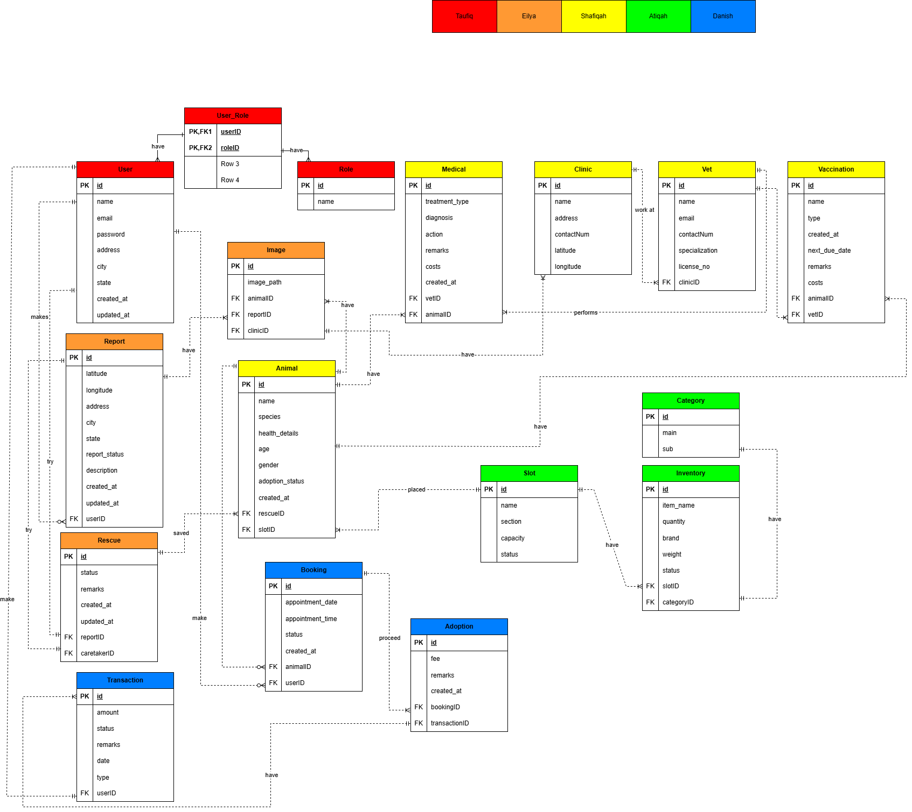

<p align="center">
  
</p>

<h1 align="center">🐾 Animal Rescue & Adoption Management System</h1>

<p align="center">
  <b>Developed for BITU3923 Workshop II at UTeM</b><br>
  A Distributed Database Application built with Laravel 11
</p>

---

## 📖 Overview

The **Animal Rescue & Adoption Management System** is a comprehensive web-based platform designed to streamline animal rescue operations, medical records management, shelter inventory tracking, and adoption processes. This project showcases a **distributed database architecture** with 5 separate databases across different database engines (PostgreSQL, MySQL, and SQL Server), demonstrating advanced database integration and cross-database relationship management.

The system provides role-based access control for administrators, caretakers, and general users, ensuring efficient animal welfare tracking, rescue coordination, and adoption services. Built as an academic project for BITU3923 Workshop II at Universiti Teknikal Malaysia Melaka (UTeM), it demonstrates enterprise-level software architecture and distributed systems design.

---

## 🚀 Features

### 👥 User Management (PostgreSQL)

- Secure user authentication and registration with Laravel Breeze
- Role-based access control using Spatie Laravel Permission (Admin, Caretaker, User)
- User profile management with editable information
- Adopter profiles with matching preferences for animal adoption
- Password reset and email verification

### 🐶 Stray Reporting & Rescue Management (MySQL)

- Submit public stray animal reports with detailed information
- Geolocation tracking using latitude and longitude coordinates
- Interactive rescue map with clustering visualization
- Assign caretakers to rescue cases for field operations
- Image gallery for rescue documentation
- Report status tracking (Pending, In Progress, Completed)

### 🏥 Animal & Medical Management (MySQL)

- Comprehensive animal database with species, breed, age, and health status
- Medical records tracking with treatment history
- Vaccination management with due date tracking
- Clinic and veterinarian assignment
- Animal profile system for adoption matching
- Link animals to rescue operations and shelter slots
- Image management for animal photos

### 🏢 Shelter Management (MySQL)

- Slot allocation system for animal housing
- Section-based shelter organization (e.g., Dog Section, Cat Section)
- Inventory management for food, medicine, and supplies
- Category-based inventory tracking
- Slot capacity and occupancy monitoring
- Automatic slot assignment to rescued animals

### 📅 Booking & Adoption Management (SQL Server)

- Appointment booking system for shelter visits
- Visit list feature allowing users to save animals they want to visit
- Multiple animal booking in a single appointment
- ToyyibPay payment integration for adoption fees
- Transaction records and payment tracking
- Adoption history and status management
- Booking conflict prevention (prevents double-booking of animals)
- Email notifications for booking confirmations

### 📊 Admin Dashboard

- Real-time overview of rescue reports, adoptions, and revenue
- Visualization of animal statistics and system metrics
- Chart-based analytics for decision making
- Database connection status monitoring with smart caching
- Cross-database data aggregation and reporting

### 🔄 Distributed Database Features

- **5 separate databases** across 3 different database engines
- **Cross-database relationships** managed at the application layer
- **Foreign key validation** in application code (no database constraints across databases)
- **Smart connection status caching** with adaptive cache duration (30 min when healthy, 60 sec when degraded)
- **Offline mode handling** with graceful degradation when databases are unavailable
- **Transaction management** across multiple database connections
- **Custom migration commands** (`db:fresh-all`) for distributed database refresh

### ERD

<p align="center">  </p>

---

# 🗄️ Distributed Database Architecture

## Overview

This project implements a **distributed database architecture** with 5 separate databases, each hosted on different database engines and ports. This architecture demonstrates real-world scenarios where organizations integrate multiple legacy systems or distribute data across different database technologies for scalability, performance, or organizational reasons.

**Key Challenge**: Cross-database relationships cannot use traditional foreign key constraints. All referential integrity is enforced at the **application layer** using Laravel's Eloquent ORM.

## Database Connections

| Connection Name | Database Engine | Port | Module/Domain | Key Tables |
|----------------|-----------------|------|---------------|------------|
| **taufiq** | PostgreSQL | 5434 | User Management | users, roles, permissions, adopter_profiles |
| **eilya** | MySQL | 3307 | Stray Reporting Management | reports, rescues, images |
| **shafiqah** | MySQL | 3309 | Animal Management | animals, medical_records, vaccinations, clinics, vets, animal_profiles |
| **atiqah** | MySQL | 3308 | Shelter Management | slots, sections, inventory, categories |
| **danish** | SQL Server | 1434 | Booking & Adoption Management | bookings, adoptions, transactions, visit_lists, animal_booking (pivot) |

## Cross-Database Relationship Pattern

Since foreign key constraints cannot exist across databases, the project uses a special Eloquent pattern:

```php
// Example: Animal model (shafiqah) accessing Rescue (eilya)
public function rescue()
{
    return $this->setConnection('eilya')
        ->belongsTo(Rescue::class, 'rescueID', 'id');
}

// Example: Booking (danish) accessing Animal (shafiqah)
public function animals()
{
    return $this->belongsToMany(
        Animal::class,
        'animal_booking',
        'bookingID',
        'animalID'
    )->using(AnimalBooking::class);
}
```

## Developer Guidelines

### 1. Always Specify Database Connection

Each Eloquent model explicitly declares its connection:

```php
class Animal extends Model
{
    protected $connection = 'shafiqah';
}
```

### 2. Validate Foreign Keys at Application Layer

Before creating records with cross-database foreign keys, always validate:

```php
// Check if rescue exists before creating animal
$rescue = Rescue::find($rescueId);
if (!$rescue) {
    throw new Exception('Invalid rescue ID');
}
```

### 3. Use Transactions Per Database

When modifying multiple databases, use separate transactions:

```php
DB::connection('shafiqah')->beginTransaction();
DB::connection('eilya')->beginTransaction();

try {
    Animal::create([...]); // shafiqah
    Image::create([...]);  // eilya

    DB::connection('shafiqah')->commit();
    DB::connection('eilya')->commit();
} catch (\Exception $e) {
    DB::connection('shafiqah')->rollBack();
    DB::connection('eilya')->rollBack();
}
```

### 4. Test Cross-Database Queries

Always test queries that span multiple databases with proper error handling.

---

## 🧩 System Architecture

| Layer                   | Technology                                |
|-------------------------|-------------------------------------------|
| **Backend Framework**   | Laravel 11 (PHP 8.2+)                     |
| **Frontend**            | Blade Templates + Tailwind CSS + Alpine.js|
| **Interactive Components** | Livewire 3.6                           |
| **Databases**           | PostgreSQL 14+ + MySQL 8.0+ + SQL Server 2019+ |
| **Authentication**      | Laravel Breeze                            |
| **Authorization**       | Spatie Laravel Permission                 |
| **Payment Gateway**     | ToyyibPay Integration                     |
| **Maps & Geolocation**  | Leaflet.js with clustering                |
| **Testing**             | Pest PHP (with SQLite in-memory)          |
| **Code Quality**        | Laravel Pint (PHP CS Fixer)               |
| **Version Control**     | Git / GitHub                              |
| **Development Server**  | Laravel Artisan + Vite                    |

---

## 🛠️ Installation & Setup

### Prerequisites

- PHP 8.2 or higher
- Composer
- Node.js & npm
- PostgreSQL 14+
- MySQL 8.0+
- SQL Server 2019+
- Git

### Initial Setup

1. **Clone the repository**
   ```bash
   git clone <repository-url>
   cd Animal-Shelter-Workshop
   ```

2. **Install dependencies and setup environment**
   ```bash
   composer setup
   # This runs: composer install, copies .env, generates app key, and builds assets
   ```

3. **Configure database connections**

   Edit `.env` file and configure all 5 database connections:
   ```env
   # Eilya (MySQL) - Stray Reporting
   DB1_HOST=127.0.0.1
   DB1_PORT=3307
   DB1_DATABASE=workshop
   DB1_USERNAME=root
   DB1_PASSWORD=your_password

   # Atiqah (MySQL) - Shelter Management
   DB2_HOST=127.0.0.1
   DB2_PORT=3308
   DB2_DATABASE=workshop2
   DB2_USERNAME=root
   DB2_PASSWORD=your_password

   # Shafiqah (MySQL) - Animal Management
   DB3_HOST=127.0.0.1
   DB3_PORT=3309
   DB3_DATABASE=workshop
   DB3_USERNAME=root
   DB3_PASSWORD=your_password

   # Danish (SQL Server) - Booking & Adoption
   DB4_HOST=127.0.0.1
   DB4_PORT=1434
   DB4_DATABASE=workshop
   DB4_USERNAME=sa
   DB4_PASSWORD=your_password

   # Taufiq (PostgreSQL) - User Management
   DB5_HOST=127.0.0.1
   DB5_PORT=5434
   DB5_DATABASE=workshop
   DB5_USERNAME=postgres
   DB5_PASSWORD=your_password

   # Session driver (use file for distributed databases)
   SESSION_DRIVER=file
   ```

4. **Run migrations and seeders**
   ```bash
   # Use custom command for distributed databases
   php artisan db:fresh-all --seed
   # OR using composer shortcut
   composer fresh
   ```

5. **Start development server**
   ```bash
   composer dev
   # This runs: php artisan serve, queue worker, log viewer, and Vite concurrently
   ```

6. **Access the application**

   Open `http://localhost:8000` in your browser

### Default Login Credentials

After seeding, you can login with:

- **Admin**: admin@example.com
- **Caretaker**: caretaker@example.com
- **User**: user@example.com

(Check `database/seeders/UserSeeder.php` for passwords)

---

## 🧪 Development Commands

### Database Operations

```bash
# Fresh migration for ALL 5 databases
php artisan db:fresh-all

# Fresh migration with seeding
php artisan db:fresh-all --seed
composer fresh  # shortcut

# Clear database connection status cache
php artisan db:clear-status-cache

# Standard migration (only for new migrations)
php artisan migrate

# Seed only
php artisan db:seed
```

**IMPORTANT**: Always use `db:fresh-all` instead of `migrate:fresh` for this project. Laravel's default `migrate:fresh` only drops tables from the default connection, not all 5 distributed databases.

### Running Development Environment

```bash
# Run all services concurrently (recommended)
composer dev

# Or run individually:
php artisan serve              # Development server
php artisan queue:listen --tries=1  # Queue worker
php artisan pail --timeout=0   # Log viewer
npm run dev                    # Vite asset compilation
```

### Testing

```bash
composer test           # Run all Pest tests
php artisan test        # Laravel test runner
php artisan test --filter=TestName  # Specific test
```

### Code Quality

```bash
./vendor/bin/pint       # Format code with Laravel Pint
```

### Assets

```bash
npm run dev            # Development mode with HMR
npm run build          # Production build
```

---

## 📂 Project Structure

```
Animal-Shelter-Workshop/
├── app/
│   ├── Console/Commands/
│   │   └── FreshAllDatabases.php    # Custom distributed DB migration command
│   ├── Http/Controllers/
│   │   ├── AnimalManagementController.php
│   │   ├── BookingAdoptionController.php
│   │   ├── StrayReportingManagementController.php
│   │   ├── ShelterManagementController.php
│   │   ├── RescueMapController.php
│   │   └── ProfileController.php
│   ├── Models/
│   │   ├── Animal.php (shafiqah)
│   │   ├── Booking.php (danish)
│   │   ├── Rescue.php (eilya)
│   │   ├── Slot.php (atiqah)
│   │   ├── User.php (taufiq)
│   │   └── ... (other models with explicit connections)
│   ├── Services/
│   │   └── DatabaseConnectionChecker.php
│   └── Livewire/
│       └── Dashboard.php
├── database/
│   ├── migrations/        # Migrations for all 5 databases
│   └── seeders/
│       └── DatabaseSeeder.php  # Orchestrates seeding order
├── resources/
│   └── views/
│       ├── animal-management/
│       ├── booking-adoption/
│       ├── stray-reporting/
│       └── shelter-management/
├── routes/
│   └── web.php           # All application routes
├── config/
│   ├── database.php      # 5 database connection configurations
│   ├── session.php       # Session configuration (file-based)
│   └── queue.php         # Queue configuration
├── CLAUDE.md            # Developer documentation for Claude Code
└── README.md            # This file
```

---

## 🔐 Security Features

- CSRF protection on all forms
- SQL injection prevention via Eloquent ORM
- XSS protection with Blade templating
- Role-based access control (RBAC)
- Secure password hashing (Bcrypt)
- Session security with file-based storage
- Payment integration with ToyyibPay secure gateway

---

## 🌟 Key Technical Highlights

1. **Distributed Database Management**: Successfully integrates 5 databases across 3 different database engines
2. **Cross-Database Relationships**: Implements complex relationships without foreign key constraints
3. **Smart Connection Caching**: Adaptive cache duration based on database health (30 min healthy, 60 sec degraded)
4. **Graceful Degradation**: Application remains partially functional when individual databases are offline
5. **Custom Artisan Commands**: `db:fresh-all` for proper distributed database migrations
6. **Booking Conflict Prevention**: Multi-layer validation system prevents double-booking of animals
7. **Geolocation Features**: Interactive maps with clustering for rescue operations
8. **Payment Integration**: Secure online payment processing for adoption fees
9. **Real-time Dashboard**: Livewire-powered analytics and metrics

---

## 📝 License

This project is developed for academic purposes as part of BITU3923 Workshop II at UTeM.

---

## 👥 Development Team

- **Taufiq** - User Management Module (PostgreSQL)
- **Eilya** - Stray Reporting Module (MySQL)
- **Shafiqah** - Animal Management Module (MySQL)
- **Atiqah** - Shelter Management Module (MySQL)
- **Danish** - Booking & Adoption Module (SQL Server)

---

## 📞 Support

For issues or questions about this project, please contact the development team or refer to the `CLAUDE.md` file for detailed developer documentation.

---

<p align="center">Made with ❤️ for Animal Welfare | UTeM BITU3923 Workshop II</p>
