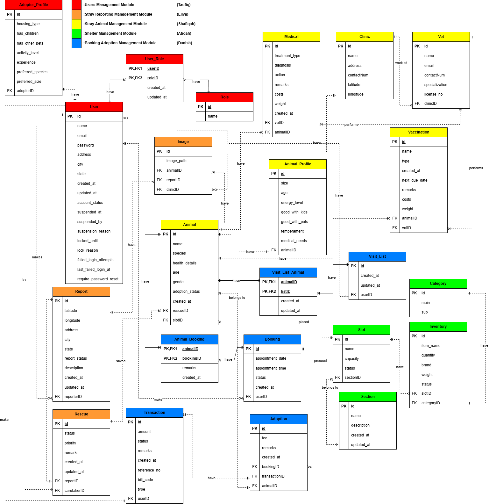
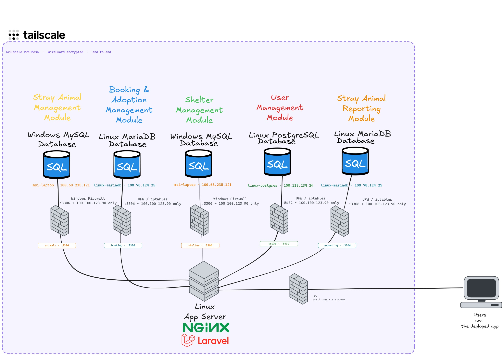

<p align="center">
  
</p>

<h1 align="center">🐾 Animal Rescue & Adoption Management System</h1>

<p align="center">
  <b>Developed for BITU3923 Workshop II at UTeM</b><br>
  A Distributed Database Application built with Laravel 11<br>
  Supervised by Ts. Fathin Nabilla
</p>

---

## 📖 What this project actually is

Picture a shelter that needs five different jobs done at once: someone has to log a stray
sighting off a phone in a car park, a caretaker needs to check a rescue in, a vet needs to attach
a vaccination record, an admin needs to see whether adoption revenue is trending up, and an adopter
just wants to book a Saturday visit and pay online. This app does all five — and, because it started
life as a five-person team project, each of those jobs also owns its **own database**, on its own
engine, on its own machine (now a personal homelab, not five people's laptops — see
[`docs/architecture-migration.md`](docs/architecture-migration.md#origin-from-a-five-person-team-project-to-a-solo-homelab-rebuild)
for how that happened).

That's the part that makes this more than a CRUD app: **five real databases across three engines**
(PostgreSQL, MySQL, MariaDB), talking to each other only through the application layer, connected
over a private Tailscale mesh with no database port ever touching the public internet. There's no
`JOIN` that can span two of them — every cross-database relationship, every rollback, every
"is the other database even reachable right now" check is something this codebase has to handle
itself. The full topology, the reasoning behind it, and exactly how cross-database writes stay
consistent are written up in [`docs/db-architecture.md`](docs/db-architecture.md),
[`docs/foreign-keys.md`](docs/foreign-keys.md), and [`docs/cross-db-queries.md`](docs/cross-db-queries.md)
— this README sticks to the tour.

Built as an academic project for BITU3923 Workshop II at Universiti Teknikal Malaysia Melaka
(UTeM), the goal was to demonstrate enterprise-shaped distributed-systems problems on a five-person
homelab budget, not to shortcut them with a single convenient database.

---

## 🚀 A tour of the five modules

Each module below owns one database connection and one corner of the shelter's actual workflow.
For the full page-by-page journey through any of them — every route, every redirect, every branch
in the logic — see its dedicated flow doc under [`docs/flows/`](docs/flows/), which also includes
an activity diagram and a use-case diagram.

### 👥 User Management — PostgreSQL

Everyone starts here: registration, login, password resets, and the role a user carries
(Admin, Caretaker, or ordinary User) through Spatie's permission package. Adopters also keep a
matching profile — housing type, energy tolerance, whether there are kids at home — that feeds
straight into the adoption-matching algorithm in the Animals module. Admins can suspend or lock an
account, force a password reset, and audit every sensitive action from a dashboard.
→ [`docs/flows/auth/flow.md`](docs/flows/auth/flow.md) ·
[`docs/flows/users-admin/flow.md`](docs/flows/users-admin/flow.md)

### 🐶 Stray Reporting & Rescue Management — MariaDB

The public-facing entry point: anyone can drop a pin on a map and submit a stray sighting with
photos, no account required. From there it's a handoff chain — a report becomes a rescue once a
caretaker is assigned, the caretaker moves it through In Progress/Success/Failed, and completing a
rescue creates the actual animal record(s) that then belong to the Animals module.
→ [`docs/flows/reporting/flow.md`](docs/flows/reporting/flow.md)

### 🏥 Animal & Medical Management — MySQL

The system of record for every animal: species, breed, medical history, vaccination schedule,
which clinic and vet looked after them, and which shelter slot they occupy. This is also where the
adoption-matching algorithm lives — scoring every available animal against an adopter's stated
preferences (species, energy level, housing, size, kids-and-other-pets compatibility) and caching
the result.
→ [`docs/flows/animals/flow.md`](docs/flows/animals/flow.md)

### 🏢 Shelter Management — MySQL

The physical side of the operation: sections, the individual slots animals actually occupy, and
the inventory of food, medicine, and supplies that keeps the place running. A slot's status isn't
something staff sets by hand day-to-day — it recomputes automatically from how many animals are
currently assigned to it versus its capacity.
→ [`docs/flows/shelter/flow.md`](docs/flows/shelter/flow.md)

### 📅 Booking & Adoption Management — MariaDB

Where the story ends, happily: an adopter builds a visit list, books an appointment, walks through
a 3-step confirmation modal with a live fee breakdown, and pays through ToyyibPay. The payment
callback has to survive duplicate webhook deliveries, browser-back races, and a gateway that might
disagree with what the browser is claiming — and if any step of "mark the booking complete, adopt
the animal, free up the slot, record the transaction" fails partway through, all of it rolls back
together rather than leaving an animal adopted with no payment on file.
→ [`docs/flows/booking-adoption/flow.md`](docs/flows/booking-adoption/flow.md)

### 📊 Admin Dashboard & Notifications

Sitting across all of the above: a Livewire-powered dashboard with booking trends, revenue by
species, and audit summaries, plus a notification bell that merges bookings, rescues, transactions,
and adoptions into one feed. Both are built to degrade gracefully — if one of the five databases is
unreachable, the dashboard shows a warning banner and zeroed metrics for that slice instead of a
500 page.
→ [`docs/flows/dashboard-notifications/flow.md`](docs/flows/dashboard-notifications/flow.md)

<p align="center">  </p>

---

## 🧪 It's actually tested — thoroughly

This isn't a demo dressed up as a distributed system. There are **343 tests across 68 files**,
every one of them running against real copies of all five databases (not mocks, not SQLite
standing in) — because a distributed-DB bug almost never shows up until a query actually crosses a
connection boundary. Building that suite surfaced real, previously-unknown bugs: registration was
completely broken at one point, password reset silently never sent an email, and a payment flow
once trusted a client-supplied fee amount.

The full breakdown — what's covered module by module, why each layer of testing exists, and the
complete list of bugs the suite caught — is in [`docs/testing.md`](docs/testing.md).

---

## 🗄️ Heterogeneous Distributed Database Architecture

<p align="center">
  
</p>

Five Laravel connections, three engines, four physical machines, one rule that shapes everything
else: **no foreign key can cross a connection**. A MariaDB server has no way to verify that an
`animalID` column points at a real row in a MySQL table on a different machine, so every
cross-database reference is validated in application code instead of by the database engine. All
five connections run over a Tailscale WireGuard mesh — no database port is ever exposed to the
public internet, and each VM's firewall accepts DB traffic only from the app-server's Tailscale IP.

| Connection | Module | Engine | Key tables |
|---|---|---|---|
| `users` | User Management | PostgreSQL 16 | users, roles, adopter_profiles, audit_log |
| `reporting` | Stray Reporting | MariaDB 10.11 | reports, rescues, images |
| `animals` | Animal & Medical | MySQL 9.5 | animals, medical_records, vaccinations, clinics, vets |
| `shelter` | Shelter Management | MySQL 9.5 | slots, sections, inventory, categories |
| `booking` | Booking & Adoption | MariaDB 10.11 | bookings, adoptions, transactions, visit_lists |

**Why MariaDB for Booking & Adoption, of all engines?** It wasn't the first choice — the module was
originally designed for SQL Server. It moved to MariaDB 10.11 because the whole stack runs on a
homelab Proxmox cluster with limited RAM, and SQL Server's ~1GB idle footprint was too much to ask
alongside three other VMs. MariaDB idles under 100MB and still offers everything the booking module
actually needs — stored procedures, triggers, real transactions — so the "three different engines"
constraint stayed genuine rather than becoming an SQL-Server-everywhere shortcut. The full migration
story (and why SSH tunnels were replaced with Tailscale along the way) is in
[`docs/architecture-migration.md`](docs/architecture-migration.md).

For everything else about this architecture — the exact table ownership per connection, the
cross-database query patterns the app relies on instead of `JOIN`, how referential integrity is
enforced without real foreign keys, and the server hardening that keeps four independent machines
surviving reboots unattended — see:

- [`docs/db-architecture.md`](docs/db-architecture.md) — full topology, connection map, table ownership
- [`docs/foreign-keys.md`](docs/foreign-keys.md) — native vs. logical foreign keys, where each is enforced
- [`docs/cross-db-queries.md`](docs/cross-db-queries.md) — the query patterns that replace cross-DB `JOIN`
- [`docs/hardening.md`](docs/hardening.md) — firewalls, systemd auto-start, defence-in-depth per machine
- `CLAUDE.md` — live server IPs, admin credentials, and the pre-migration checklist for provisioning
  the `workshop_2` database/user on all three engines

---

## 🏗️ Standing up the infrastructure from scratch

The `infrastructure/` directory holds everything needed to provision all four VMs on a Proxmox
homelab node — Terraform for the VMs themselves, Ansible for everything that runs on top of them
(the three database engines, the app deployment, and the firewall rules from `docs/hardening.md`).

```
infrastructure/
├── terraform/    # Proxmox VM provisioning (4 VMs via cloud-init + Tailscale)
└── ansible/      # DB engine + app-server setup on the provisioned VMs
```

Provisioning is a two-step `terraform apply` then `ansible-playbook playbooks/site.yml`, but there
are a handful of one-time Proxmox prerequisites (a cloud-init template, an API token, a Tailscale
auth key) that need to exist first. The complete walkthrough — including what to do if the VMs
already exist and you just want to reconfigure them — lives in
[`docs/terraform.md`](docs/terraform.md) and [`docs/ansible.md`](docs/ansible.md); this README
won't duplicate it.

That Proxmox node is a shared personal homelab, not infrastructure dedicated to this project alone —
see [taufiq's homelab repo](https://github.com/tttaufiqqq/oracle-db-linux-proxmox) for the full VM/CT
inventory, the other database engines and services it also runs, and how the Tailscale mesh and
DNS layer these VMs sit on were built.

---

## 🛠️ Running it locally

You don't need to install a single database engine on your own machine — the three that back this
app are already running on the project's Proxmox homelab, and you just need to be on the Tailscale
tailnet to reach them.

**Prerequisites**: PHP 8.3+, Composer, Node.js & npm, Git, and a Tailscale connection to the
project's tailnet.

```bash
# 1. Clone and install
git clone <repository-url>
cd Animal-Shelter-Workshop
composer setup          # composer install + .env + app key + built assets

# 2. Fill in the 5 database connections in .env (see .env.example for all fields —
#    every host is a Tailscale IP, so step 1's tailnet connection has to be live)

# 3. Migrate + seed all 5 databases at once
php artisan db:fresh-all --seed
# (composer fresh is a shortcut for the same thing)

# 4. Start everything — server, queue worker, log viewer, and Vite — together
composer dev
```

Then open `http://localhost:8000`. If it's your first time touching this codebase, one command is
worth knowing before you run anything else:

> **Never use `migrate:fresh` here.** Laravel's built-in version only drops tables on the *default*
> connection — with five named connections and none of them default, it silently does nothing
> useful. `php artisan db:fresh-all` is the custom command that actually wipes and rebuilds all five.

### Try it out without creating an account

Every seeded account below uses the password `password`:

| Role | Email | What you can do with it |
|------|-------|--------------------------|
| Admin | admin1@gmail.com / admin2@gmail.com | Full system access, dashboard, audit log |
| Caretaker | caretaker1@gmail.com / caretaker2@gmail.com | Rescue operations, animal medical records |
| Public User | taufiq@ · shafiqah@ · atiqah@ · danish@ · eilya@gmail.com | Submit reports, book adoptions |

---

## 🧰 Everyday commands

```bash
# Database
php artisan db:fresh-all --seed     # wipe + reseed all 5 databases (see warning above)
php artisan db:clear-status-cache   # clear the "is this DB reachable" cache
php artisan migrate                 # apply new migrations only

# Development server (all services at once)
composer dev

# Tests — see docs/testing.md for what each layer actually proves
composer test
php artisan test --filter=TestName

# Code style
./vendor/bin/pint
```

---

## 🧩 Tech stack at a glance

| Layer                   | Technology                                |
|-------------------------|-------------------------------------------|
| **Backend Framework**   | Laravel 11 (PHP 8.3+)                     |
| **Frontend**            | Blade Templates + Tailwind CSS + Alpine.js|
| **Interactive Components** | Livewire 3.6                           |
| **Databases**           | PostgreSQL 16 + MySQL 9.5 + MariaDB 10.11 |
| **VPN / Networking**    | Tailscale (WireGuard mesh)                |
| **Authentication**      | Laravel Breeze                            |
| **Authorization**       | Spatie Laravel Permission                 |
| **Payment Gateway**     | ToyyibPay Integration                     |
| **Maps & Geolocation**  | Leaflet.js with clustering                |
| **Testing**             | Pest PHP 4 + Playwright (real distributed DBs, not mocks — see [`docs/testing.md`](docs/testing.md)) |
| **Code Quality**        | Laravel Pint (PHP CS Fixer)               |
| **Infrastructure**      | Terraform + Ansible ([`docs/terraform.md`](docs/terraform.md), [`docs/ansible.md`](docs/ansible.md)) |

---

## 📂 Finding your way around

```
Animal-Shelter-Workshop/
├── app/
│   ├── Http/Controllers/         # AnimalManagement, BookingAdoption, StrayReporting, ShelterManagement...
│   ├── Models/                   # every model declares an explicit $connection — see docs/db-architecture.md
│   ├── Services/                 # DatabaseConnectionChecker and friends
│   └── Livewire/                 # Dashboard, Notifications, ReportsTable, UserReportsTracker
├── database/
│   ├── migrations/               # one set per connection, all run together via db:fresh-all
│   └── seeders/
├── docs/
│   ├── flows/{module}/           # page flow + activity diagram + use-case diagram, per module
│   ├── testing.md                # what's tested and why
│   ├── db-architecture.md        # the full distributed-DB picture
│   └── ...                       # foreign-keys, cross-db-queries, hardening, terraform, ansible
├── tests/                        # Unit, Feature, Procedures, Browser — see docs/testing.md
├── routes/
│   ├── web.php
│   └── partials/                 # one route file per module
├── CLAUDE.md                     # live infra details, dev conventions, credentials
└── README.md                     # this file
```

---

## 🔐 Security

CSRF protection on every form, SQL injection prevention via Eloquent's parameter binding, XSS
protection through Blade's automatic escaping, role-based access control, bcrypt password hashing,
and a secure gateway integration for payments. None of the database ports are reachable from
outside the Tailscale mesh in the first place — see [`docs/hardening.md`](docs/hardening.md) for
exactly how each of the four machines is locked down and kept running unattended.

---

## 🌟 What makes this one worth a second look

1. **Five databases, three engines, one application layer holding it all together** — with no
   cross-database foreign key to lean on.
2. **Graceful degradation that's actually tested, not just hoped for** — the app keeps serving
   readable pages when a database goes offline, and the test suite proves it (see
   [`docs/testing.md`](docs/testing.md)).
3. **A payment flow that doesn't trust the client** — the adoption fee is always recomputed
   server-side, and the ToyyibPay gateway's own status is cross-checked, not just assumed.
4. **343 tests against real infrastructure**, not a simplified local stand-in — see
   [`docs/testing.md`](docs/testing.md) for the bugs that testing actually caught.
5. **Real infrastructure-as-code**, not a README describing steps someone did by hand once —
   Terraform + Ansible can rebuild all four machines from nothing.

---

## 📝 License

This project is developed for academic purposes as part of BITU3923 Workshop II at UTeM.

---

## 👥 Development Team

| Member | Module | Database Engine |
|--------|--------|----------------|
| **Taufiq** | User Management | PostgreSQL 16 |
| **Eilya** | Stray Reporting | MariaDB 10.11 |
| **Shafiqah** | Animal Management | MySQL 9.5 |
| **Atiqah** | Shelter Management | MySQL 9.5 |
| **Danish** | Booking & Adoption | MariaDB 10.11 |

**Supervisor:** Ts. Fathin Nabilla

---

## 📞 Support

For issues or questions about this project, please contact the development team, or start with
[`docs/testing.md`](docs/testing.md) and [`docs/flows/`](docs/flows/) for how a given feature
actually behaves, and `CLAUDE.md` for infrastructure and developer conventions.

---

<p align="center">Made with ❤️ for Animal Welfare | UTeM BITU3923 Workshop II</p>
